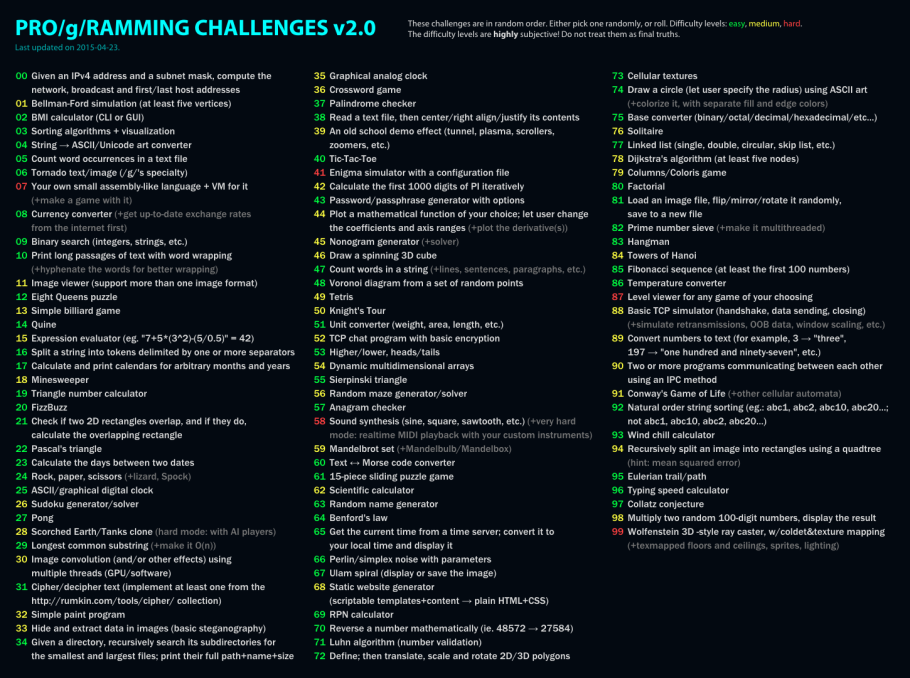

# Programming-Challenges-v2.0
> In the project im going to solve some issues from Programming-Challenges-v2.

## Table of contents
* [General info](#general-info)
* [Screenshots](#screenshots)
* [Technologies](#technologies)
* [Setup](#setup)
* [Status](#status)
* [Contact](#contact)

## General info
I'm going to solve some programing issues which are included in the [Screenshots](#screenshots).
I will try to use some good patterns in commiting the changes into repository.
The project should be treated as an example of good patterns in git. 

## Screenshots

## Technologies
* Java - version 11.0

## Setup
Project will be written in Eclipse IDE. 
If you want to quickly open the repository:
* clone the repository into your computer
* next steps soon

## Code Examples
Show examples of usage:
`put-your-code-here`

## Status
Project is: _in progress_

## Contact
Created by [@MarcinJastrzebski](https://www.linkedin.com/in/marcinjastrzebski/?locale=en_US) - feel free to contact me!